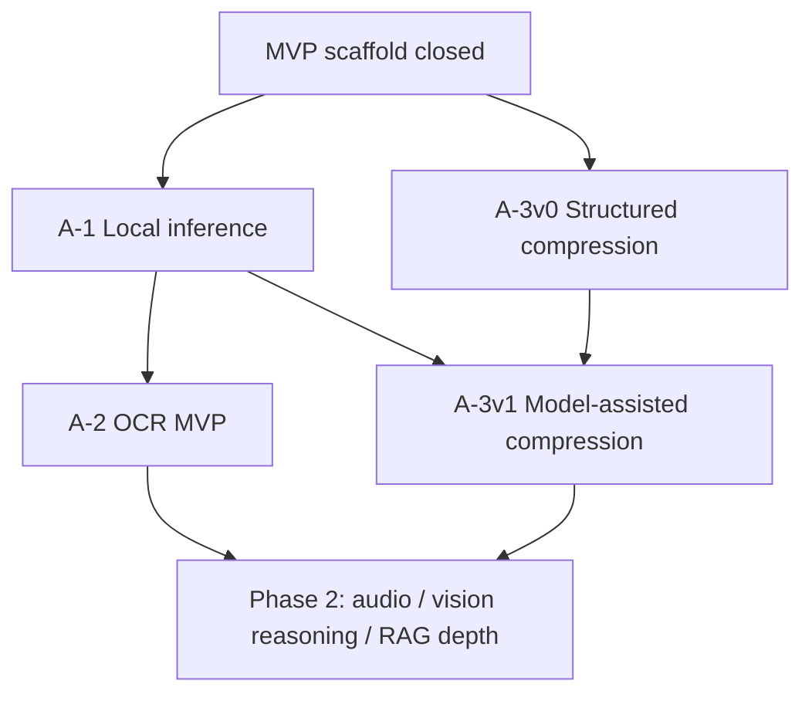

# Phase 1 Remaining Tasks — Design Memo (for Codex)

## Purpose

This memo helps **Codex** decide which post-scaffold work belongs in **Phase 1** versus **Phase 2**, among the three high-value tracks discussed after Chat device polish (#5–#10):

| ID | Track | One-line description |
| --- | --- | --- |
| **A-1** | Local inference | Replace heuristic / bridge stubs with a real on-device LLM path |
| **A-2** | Multimodal input | Wire iPhone capture (OCR / camera first) into `runtime/` |
| **A-3** | Context compression | Upgrade transcript packaging before local/cloud execution |

**Audience:** Codex (planning, acceptance criteria, merge policy). Cursor implements approved slices.

**Status:** Draft for Codex decision — not an implementation spec.

---

## Current Baseline (2026-05-20, `main` @ #10)

### What Phase 1 scaffold already satisfies

Per `docs/product/mvp_completion_plan.md`, the **policy + UI scaffold** checkpoint is closed:

- routing preview, sensitivity modes, diagnostics, settings policy copy
- Chat control-surface polish, device install workflow documented
- **37** `PREXUSTests` passing

### What is still stubbed in `runtime/`

| Component | Current behavior | Phase 1 gap |
| --- | --- | --- |
| `LocalModelClient` / `DeviceRuntimeLocalModelClient` | Returns a fixed bridge string; no packaged model | No real on-device generation |
| `HeuristicContextCompressor` | Last 4 messages joined with `\n` | No summarization, budget, or dedup |
| `OCRProcessor` / `VisionAnalyzer` | Protocols only; no app wiring | No capture UI or Vision framework pipeline |
| Cloud path | Real HTTP + token budget trim | Works; benefits from better compression |

**Conclusion:** PREXUS is a **credible routing and policy runtime**, not yet a **credible local cognitive runtime** on hardware.

---

## Phase 1 Success Criteria (from product docs)

`docs/product/roadmap.md` Phase 1 targets:

| Metric | Implication |
| --- | --- |
| iPhone 単体でローカル会話可能 | Requires **A-1** (not heuristics-only) |
| 手動モデル選択なしでも実用 | Routing done; needs local quality + compression |
| トークン削減が目に見える | Requires **A-3** (cloud + local prompts) |
| OCR 入力が使い物になる | Requires **A-2** narrow slice (OCR), not full multimodal |

Roadmap **execution order** (cross-phase) still lists:

1. ローカル推論基盤 → 2. ルーティング → 3. 圧縮 → … → 6. Vision → 7. 音声

Routing (#2) is advanced; **#1 and #3 remain the honest Phase 1 closure work**.

---

## Option Analysis

### A-1 — Local inference (on-device LLM)

**Delivers:** Real `generate()` on device; satisfies “local conversation on iPhone.”

**Touches:**

- `runtime/llm/local/LocalModelClient.swift`
- model asset packaging (`models/`), Metal/MLX or llama.cpp bridge
- Settings backend selector (already exposes `LocalModelBackend`)
- battery/thermal guardrails, load/unload policy

**Strengths**

- Aligns with PREXUS identity (local-first control plane)
- Unblocks meaningful evaluation of routing (local vs cloud tradeoffs)
- Required before compression/routing quality can be judged on-device

**Risks**

- Large engineering surface (model choice, size, streaming, crash recovery)
- Simulator vs device divergence (keep simulator mock; device-only truth path)
- App Store / memory ceiling on older phones (iPhone XS Max class)

**Dependencies:** None among A-1/A-2/A-3. **Should lead Phase 1 remaining work.**

---

### A-3 — Context compression

**Delivers:** Smaller, structured prompts; visible token reduction; better cloud economics.

**Touches:**

- `runtime/memory/compression/ContextCompressor.swift`
- `RuntimeTurnExecutor` prompt assembly
- optional use of local model for summarization (pairs with A-1)

**Strengths**

- Already on the hot path (`compressor.compress` before execution)
- Improves cloud immediately even if local model is immature
- Low UI churn; testable with unit tests

**Risks**

- Summarization quality without A-1 may stay heuristic-only
- Over-compression can drop routing-critical facts (must be policy-gated)

**Dependencies:** **Soft dependency on A-1** for “real” compression; can ship **Compression v0** (structured blocks + token budget + dedup) in parallel with early A-1, then **Compression v1** (model-assisted) after first local model lands.

---

### A-2 — Multimodal input

**Delivers:** Sensor platform story; OCR / camera as input to routing.

**Touches:**

- `runtime/multimodal/ocr/`, `vision/`
- new iOS capture UI (camera / photo picker) — **must not** entangle with Chat layout more than necessary
- routing already has `RuntimeModality` and reason codes (`ocr_extraction`, `vision_reasoning`, etc.)

**Strengths**

- Differentiated product narrative (iPhone as sensor)
- Roadmap Phase 1 explicitly names OCR

**Risks**

- Highest UI + permission + privacy surface (camera, photos)
- Vision reasoning and audio are Phase 2 scale; easy to over-scope
- OCR without A-1 still escalates to cloud for “understanding”

**Dependencies:** Routing contract exists. **Practical order:** thin **OCR MVP** after A-1 baseline (or in parallel only if team capacity splits).

**Recommended Phase 1 slice:** **OCR capture → text → existing text turn** — not live camera streaming, not audio, not vision reasoning chain.

---

## Dependency Graph

---

## Recommendation for Codex

### Adopt as **Phase 1 remaining** (ordered)

| Order | ID | Name | Exit criteria (merge gate) |
| --- | --- | --- | --- |
| **1** | **P1-1** | **Local inference MVP** (A-1) | On physical iPhone, `deviceRuntime` backend runs one bundled small model; streaming or chunked reply; fallback to heuristic on failure; PREXUSTests + device checklist; no regression to routing/diagnostics |
| **2** | **P1-2** | **Compression v0** (A-3 partial) | Structured context blocks + token budget enforcement + tests; cloud prompt size measurably reduced vs suffix-4 heuristic |
| **3** | **P1-3** | **Compression v1** (A-3 + A-1) | Local model summarizes transcript slice under policy; documented failure mode when local unavailable |
| **4** | **P1-4** | **OCR input MVP** (A-2 narrow) | User attaches/captures image → on-device OCR text → `RuntimeTurnInput.text` / modality policy; routing reasons visible; sensitivity rules honored |

### Explicitly **defer to Phase 2**

| Item | Why defer |
| --- | --- |
| Live camera / continuous vision | Battery, thermal, UX complexity |
| Audio / ASR / wake word | Roadmap Phase 2; large stack |
| Vision reasoning beyond OCR text | Escalation-heavy; needs local model quality |
| Vector RAG depth / long-horizon memory UI | Phase 2 roadmap |
| Agent / shortcuts / MCP | Phase 3 |

### Do **not** treat as Phase 1 blockers

- Further Chat glass polish (unless regression)
- Committed simulator screenshot refresh (docs hygiene)
- Narrow-width chip tweaks (opportunistic)

---

## Suggested Work Packages (for handoff to Cursor)

### P1-1 — Local inference MVP

**Scope**

- Pick **one** backend for v1 (recommend: MLX *or* llama.cpp — Codex chooses per `docs/research/local_llm_notes.md` evaluation)
- One **small** instruct model tier (e.g. 2–4B class) for iPhone 15+; explicit unsupported behavior on older devices if needed
- Lazy load, single-flight generation, cancel on new send (align with `ChatViewModel` serial send)
- Simulator remains `SimulatorMockLocalModelClient`

**Out of scope**

- Model zoo / user-downloadable catalog
- Mac LAN offload

### P1-2 — Compression v0

**Scope**

- Replace `HeuristicContextCompressor` suffix-only behavior with: role-labeled blocks, recency window, hard token estimate, dedup of system lines
- Wire metrics hook for test: byte/token count before cloud call

**Out of scope**

- LLM summarization (P1-3)

### P1-4 — OCR input MVP

**Scope**

- Photo picker or single-frame capture → `Vision`/`VNRecognizeTextRequest` adapter implementing `OCRProcessor`
- Composer affordance: attach image → show extracted text preview → send as turn with modality metadata
- Route banner reflects OCR-related reason codes when applicable

**Out of scope**

- Video, live preview pipeline, on-device scene understanding

---

## Decision Questions for Codex

Please record decisions on:

1. **Backend choice for P1-1** — MLX vs llama.cpp vs Core ML converted (tradeoff: dev velocity, memory, streaming).
2. **Minimum device class** — iPhone 15+ only for real local model, or support A12+ with smaller quant?
3. **P1-2 vs P1-1 ordering** — allow parallel Compression v0 while local model integrates, or strictly sequential?
4. **OCR in Phase 1** — confirm P1-4 in Phase 1, or slip to Phase 2 if P1-1 slips schedule?
5. **Phase 1 “done” definition** — extend `mvp_completion_plan.md` with a new table for P1-1…P1-4, or create `phase1_completion_plan_v2.md`?

---

## Documentation Impact

When Codex approves the slice order:

| Doc | Action |
| --- | --- |
| `docs/product/mvp_completion_plan.md` | Add “Post-scaffold Phase 1” section or pointer to v2 plan |
| `docs/product/roadmap.md` | Optional: annotate Phase 1 bullets with P1-1…P1-4 IDs |
| `docs/requirements/architecture.md` | Document local model lifecycle + compression ownership |
| `docs/research/local_llm_notes.md` | Append decision record after backend choice |

---

## Summary (default recommendation)

**Phase 1 remaining tasks should be:**

1. **Local inference** (A-1) — **first**, closes the product promise gap  
2. **Context compression** (A-3) — **v0 in parallel, v1 after local model**  
3. **Multimodal** (A-2) — **OCR-only MVP last among the three**, not full multimodal  

This ordering matches `roadmap.md` execution priority, `requirements_v0.1.md` local-first framing, and the current codebase reality: routing is ready; **inference, compression, and OCR are the real remaining Phase 1 work**.

---

## Related Docs

- [roadmap.md](./roadmap.md)
- [mvp_completion_plan.md](./mvp_completion_plan.md)
- [agent_collaboration_workflow.md](./agent_collaboration_workflow.md)
- [multimodal_strategy.md](../requirements/multimodal_strategy.md)
- [local_llm_notes.md](../research/local_llm_notes.md)
- [device_install_and_screenshot_workflow.md](../design/device_install_and_screenshot_workflow.md)
